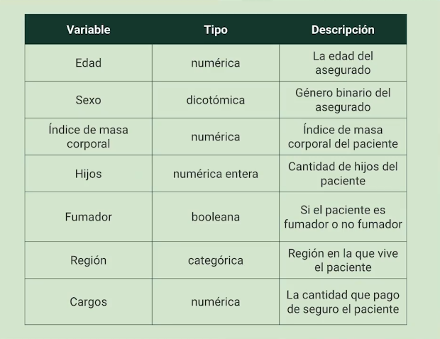
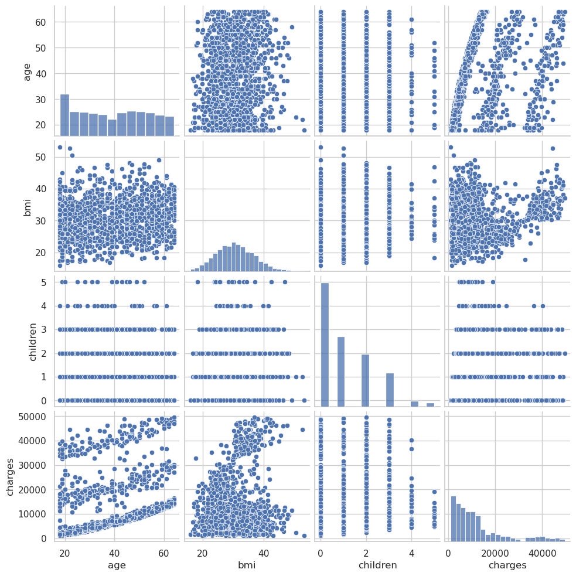

# scikit-learn-regresion-lineal
Regresión lineal de datos con la libreria de scikit-learn

## Dataset: https://www.kaggle.com/datasets/mirichoi0218/insurance

## Instalación de paquetes con Anaconda:
* conda activate entorno
* conda install --file ./requirements.txt

# Variables de la base de datos

# La variable predictora sera charges

# Resultados
Se observa que los gastos medicos de los pacientes dependen linealmente de sobrepeso*fumador (1 si es fumador y tiene sobrepeso, 0 en otro caso), smoker_yes(fuma), age^2(edad al cuadrado), children(hijos), mientras que la ubicación no tiene relevancia.

=========Summary========
Residuals:
    Min     1Q  Median     3Q    Max
-1.8027 0.0671  0.1073 0.1412 0.3346

Coefficients:
                   Estimate  Std. Error  t value   p value
_intercept         0.000000    0.020851   0.0000  1.000000
sobrepeso*fumador  0.496870    0.025032  19.8491  0.000000
smoker_yes         0.451462    0.025661  17.5933  0.000000
age2               0.325745    0.020371  15.9907  0.000000
children           0.078523    0.021796   3.6027  0.000363

R-squared:  0.86094,    Adjusted R-squared:  0.85924
F-statistic: 507.67 on 4 features